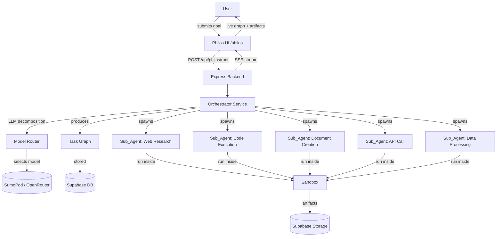

# Design Document: Noir Philos Agentic System

## Overview

Noir Philos is a full-stack agentic AI system embedded in the Noir platform. A user submits a plain-language goal; the Orchestrator decomposes it into a directed acyclic Task_Graph; specialist Sub_Agents execute nodes in parallel inside a sandboxed environment; and real, downloadable Artifacts are delivered to the user — all with live visibility into every step.

The system is built on the existing Noir stack: Express.js backend, React 19 + TypeScript frontend, Supabase (PostgreSQL + Auth + Storage), SumoPod (Gemini Flash Lite) and OpenRouter (GPT-5, Claude, Gemini Pro). It adds a `/philos` route, a set of new Express API endpoints under `/api/philos/`, and a new suite of Supabase tables.

---

## Architecture

### High-Level Flow



### Component Layers

```
Frontend (React 19 + Vite)
  └── /philos route → PhilosPage
        ├── GoalInput
        ├── RunHistorySidebar
        ├── ActiveRunPanel (live Task_Graph + SSE)
        └── ResultsPanel (Artifacts + step inspector)

Backend (Express.js)
  └── /api/philos/*
        ├── OrchestratorService
        ├── SubAgentRunner (per-task worker)
        ├── ModelRouter
        ├── SandboxManager
        ├── MemoryStore (Supabase adapter)
        ├── IntegrationManager (OAuth tokens)
        └── WorkflowScheduler (node-cron)

Data Layer (Supabase)
  ├── philos_runs
  ├── philos_tasks
  ├── philos_artifacts
  ├── philos_memory
  ├── philos_workflows
  ├── philos_integrations
  └── Storage bucket: philos-artifacts
```

---

## Components and Interfaces

### OrchestratorService

Responsible for goal intake, Task_Graph construction, and Sub_Agent lifecycle management.

```typescript
interface OrchestratorService {
  createRun(userId: string, goal: string, options: RunOptions): Promise<Run>;
  buildTaskGraph(runId: string, goal: string, memoryContext: string): Promise<TaskGraph>;
  executeGraph(runId: string, graph: TaskGraph): Promise<void>;
  retryTask(taskId: string): Promise<void>;
  cancelRun(runId: string): Promise<void>;
  pauseRun(runId: string): Promise<void>;
  resumeRun(runId: string): Promise<void>;
}

interface RunOptions {
  preferredModel?: string;
  domainAllowlist?: string[];
  persistArtifacts?: boolean;
  workflowId?: string;
}
```

### SubAgentRunner

Executes a single task node inside the Sandbox. Each invocation is stateless; context is injected from upstream task outputs.

```typescript
type AgentType = 'web_research' | 'code_execution' | 'document_creation' | 'api_call' | 'data_processing' | 'general';

interface SubAgentRunner {
  run(task: Task, context: AgentContext): Promise<AgentResult>;
  getAgentType(taskDescription: string): AgentType;
}

interface AgentContext {
  upstreamOutputs: Record<string, string>;
  memorySnippets: string[];
  integrationTokens: Record<string, string>;
  model: string;
  sandboxWorkdir: string;
}

interface AgentResult {
  taskId: string;
  output: string;
  artifacts: ArtifactRef[];
  toolCallLog: ToolCall[];
  status: 'completed' | 'failed' | 'timed_out';
  durationMs: number;
}
```

### ModelRouter

Selects the AI model for each Sub_Agent based on task complexity and user tier.

```typescript
interface ModelRouter {
  selectModel(task: Task, userTier: 'free' | 'pro', runPreference?: string): string;
  fallback(currentModel: string): string | null;
}

// Priority list for fallback
const MODEL_PRIORITY = [
  'openai/gpt-5',
  'anthropic/claude-opus-4',
  'google/gemini-pro-2',
  'sumopod/gemini-flash-lite', // always last resort / free tier only
];
```

### SandboxManager

Manages isolated execution environments per Run. Uses Node.js `child_process` with restricted permissions and a virtual workspace directory under `/tmp/philos/{runId}/`.

```typescript
interface SandboxManager {
  createWorkspace(runId: string): Promise<string>; // returns workdir path
  executeCode(workdir: string, code: string, timeoutMs: number): Promise<ExecResult>;
  readFile(workdir: string, relativePath: string): Promise<Buffer>;
  writeFile(workdir: string, relativePath: string, content: Buffer): Promise<void>;
  cleanup(runId: string): Promise<void>;
  isAllowedDomain(domain: string, allowlist: string[]): boolean;
}
```

### MemoryStore

Supabase-backed persistence layer for Runs, outputs, Artifacts, and user preferences.

```typescript
interface MemoryStore {
  saveRun(run: Run): Promise<void>;
  getRelevantContext(userId: string, goal: string, limit?: number): Promise<string[]>;
  savePreferences(userId: string, prefs: UserPreferences): Promise<void>;
  getPreferences(userId: string): Promise<UserPreferences>;
  deleteEntry(userId: string, entryId: string): Promise<void>;
  searchMemory(userId: string, query: string): Promise<MemoryEntry[]>;
}
```

### IntegrationManager

Handles OAuth token storage, refresh, and revocation for external service integrations.

```typescript
type IntegrationProvider = 'gmail' | 'github' | 'slack' | 'google_drive' | 'notion';

interface IntegrationManager {
  getAuthUrl(provider: IntegrationProvider, userId: string): string;
  handleCallback(provider: IntegrationProvider, code: string, userId: string): Promise<void>;
  getToken(userId: string, provider: IntegrationProvider): Promise<string>;
  refreshToken(userId: string, provider: IntegrationProvider): Promise<string>;
  revokeIntegration(userId: string, provider: IntegrationProvider): Promise<void>;
  listIntegrations(userId: string): Promise<IntegrationRecord[]>;
}
```

### WorkflowScheduler

Wraps `node-cron` to manage scheduled and condition-triggered Workflow execution.

```typescript
interface WorkflowScheduler {
  saveWorkflow(userId: string, config: WorkflowConfig): Promise<Workflow>;
  scheduleWorkflow(workflowId: string, cronExpression: string): void;
  unscheduleWorkflow(workflowId: string): void;
  triggerWorkflow(workflowId: string): Promise<Run>;
  listWorkflows(userId: string): Promise<Workflow[]>;
}
```

### SSE Event Stream

The backend pushes run events to the frontend via Server-Sent Events on `GET /api/philos/runs/:runId/stream`.

```typescript
type PhilosEvent =
  | { type: 'task_status'; taskId: string; status: TaskStatus; agentType: AgentType }
  | { type: 'tool_call'; taskId: string; tool: string; detail: string }
  | { type: 'task_output'; taskId: string; partialOutput: string }
  | { type: 'artifact_ready'; artifactId: string; url: string; format: ArtifactFormat }
  | { type: 'run_complete'; runId: string; summary: RunSummary }
  | { type: 'run_error'; runId: string; message: string };
```

---

## Data Models

### Supabase Tables

```sql
-- Runs
create table philos_runs (
  id uuid primary key default gen_random_uuid(),
  user_id uuid references auth.users not null,
  goal text not null,
  status text not null default 'pending', -- pending | running | paused | completed | failed | cancelled
  task_graph jsonb,
  preferred_model text,
  domain_allowlist text[],
  persist_artifacts boolean default false,
  workflow_id uuid references philos_workflows,
  started_at timestamptz,
  completed_at timestamptz,
  created_at timestamptz default now()
);

-- Tasks (nodes in the Task_Graph, stored flat for querying)
create table philos_tasks (
  id uuid primary key default gen_random_uuid(),
  run_id uuid references philos_runs not null,
  parent_task_id uuid references philos_tasks,
  description text not null,
  agent_type text not null,
  status text not null default 'queued', -- queued | running | completed | failed | timed_out | skipped
  model_used text,
  input_context jsonb,
  output text,
  tool_call_log jsonb,
  retry_count int default 0,
  started_at timestamptz,
  completed_at timestamptz,
  duration_ms int,
  created_at timestamptz default now()
);

-- Artifacts
create table philos_artifacts (
  id uuid primary key default gen_random_uuid(),
  run_id uuid references philos_runs not null,
  task_id uuid references philos_tasks,
  user_id uuid references auth.users not null,
  name text not null,
  format text not null, -- pdf | docx | pptx | xlsx | md | html
  storage_path text not null,
  download_url text,
  size_bytes int,
  created_at timestamptz default now()
);

-- Memory entries
create table philos_memory (
  id uuid primary key default gen_random_uuid(),
  user_id uuid references auth.users not null,
  run_id uuid references philos_runs,
  content text not null,
  embedding vector(1536), -- for semantic search via pgvector
  tags text[],
  created_at timestamptz default now()
);

-- User preferences
create table philos_preferences (
  user_id uuid primary key references auth.users,
  preferred_output_format text default 'md',
  preferred_tone text default 'professional',
  preferred_language text default 'en',
  default_model text,
  updated_at timestamptz default now()
);

-- Integrations (OAuth tokens)
create table philos_integrations (
  id uuid primary key default gen_random_uuid(),
  user_id uuid references auth.users not null,
  provider text not null, -- gmail | github | slack | google_drive | notion
  access_token text not null, -- encrypted at rest
  refresh_token text,
  expires_at timestamptz,
  scopes text[],
  created_at timestamptz default now(),
  unique(user_id, provider)
);

-- Workflows
create table philos_workflows (
  id uuid primary key default gen_random_uuid(),
  user_id uuid references auth.users not null,
  name text not null,
  goal text not null,
  run_options jsonb,
  cron_expression text,
  condition_trigger jsonb,
  is_active boolean default true,
  last_run_at timestamptz,
  created_at timestamptz default now()
);
```

### TypeScript Types

```typescript
interface Run {
  id: string;
  userId: string;
  goal: string;
  status: 'pending' | 'running' | 'paused' | 'completed' | 'failed' | 'cancelled';
  taskGraph: TaskGraph | null;
  preferredModel?: string;
  workflowId?: string;
  startedAt?: Date;
  completedAt?: Date;
}

interface Task {
  id: string;
  runId: string;
  parentTaskId?: string;
  description: string;
  agentType: AgentType;
  status: 'queued' | 'running' | 'completed' | 'failed' | 'timed_out' | 'skipped';
  dependencies: string[]; // task IDs that must complete first
  output?: string;
  retryCount: number;
}

interface TaskGraph {
  nodes: Task[];
  edges: Array<{ from: string; to: string }>;
}

type ArtifactFormat = 'pdf' | 'docx' | 'pptx' | 'xlsx' | 'md' | 'html';

interface Artifact {
  id: string;
  runId: string;
  taskId: string;
  name: string;
  format: ArtifactFormat;
  storagePath: string;
  downloadUrl: string;
}

interface UserPreferences {
  preferredOutputFormat: ArtifactFormat;
  preferredTone: string;
  preferredLanguage: string;
  defaultModel?: string;
}
```

---

## Correctness Properties

*A property is a characteristic or behavior that should hold true across all valid executions of a system — essentially, a formal statement about what the system should do. Properties serve as the bridge between human-readable specifications and machine-verifiable correctness guarantees.*

### Property 1: Task_Graph leaf nodes are single-step

*For any* goal submitted to the Orchestrator, every leaf node in the produced Task_Graph must have a description that is executable by a single Sub_Agent in one step (i.e., no leaf node contains further decomposable sub-goals as indicated by the absence of child nodes).

**Validates: Requirements 1.2**

---

### Property 2: Plan modification is reflected in Task_Graph

*For any* Task_Graph and any valid user modification (add task, remove task, reorder), applying the modification and re-fetching the Task_Graph should return a graph that contains exactly the modification and is otherwise structurally equivalent.

**Validates: Requirements 1.4**

---

### Property 3: Independent tasks execute concurrently

*For any* Task_Graph containing two or more tasks with no dependency edges between them, those tasks must have overlapping execution time windows (i.e., the start time of task B must be before the completion time of task A when they are independent).

**Validates: Requirements 2.1**

---

### Property 4: Dependency ordering is enforced

*For any* Task_Graph, no task may transition to `running` status before all tasks listed in its `dependencies` array have reached `completed` status.

**Validates: Requirements 2.2**

---

### Property 5: Upstream output is injected into downstream context

*For any* task T with a dependency on task U, the `input_context` of T must contain the `output` of U after U completes.

**Validates: Requirements 2.3, 10.2**

---

### Property 6: Sub_Agent retry count is bounded

*For any* Sub_Agent task that fails on every attempt, the system must attempt execution exactly up to 3 times (retry_count ≤ 3) before marking the task as `failed`.

**Validates: Requirements 2.5**

---

### Property 7: Agent type assignment matches task classification

*For any* task description, the `agentType` assigned by the Orchestrator must match the output of the task classifier function. Specifically: web retrieval tasks → `web_research`; code tasks → `code_execution`; document tasks → `document_creation`; API tasks → `api_call`; data transformation tasks → `data_processing`; unclassified tasks → `general`.

**Validates: Requirements 3.1, 3.2, 3.3, 3.4, 3.5, 3.6**

---

### Property 8: Sandbox filesystem isolation

*For any* Sub_Agent code execution, any attempt to read or write a path outside `/tmp/philos/{runId}/` must be blocked and return an error, while paths inside the workspace must succeed.

**Validates: Requirements 4.1**

---

### Property 9: Sandbox network allowlist enforcement

*For any* outbound network request from a Sub_Agent, if the target domain is not in the Run's `domainAllowlist`, the request must be blocked, the attempt logged, and the Orchestrator notified.

**Validates: Requirements 4.2, 4.3**

---

### Property 10: Sandbox workspace cleanup

*For any* completed Run where `persistArtifacts` is false, querying the filesystem for `/tmp/philos/{runId}/` after completion must return no results.

**Validates: Requirements 4.5**

---

### Property 11: Model selection is determined by task complexity and user tier

*For any* task and user, the model selected by the Model_Router must satisfy: (a) free-tier users always receive `sumopod/gemini-flash-lite` regardless of task complexity; (b) pro-tier users receive a SumoPod model for low-complexity tasks and an OpenRouter model for high-complexity tasks; (c) a run-level model preference overrides complexity-based selection for pro-tier users.

**Validates: Requirements 5.1, 5.2, 5.3, 5.4, 5.5**

---

### Property 12: Model fallback on error

*For any* model that returns an error or rate-limit response, the Model_Router must select the next model in the priority list and log the fallback event. If no fallback is available, the task must fail with a descriptive error.

**Validates: Requirements 5.6**

---

### Property 13: Run persistence round-trip

*For any* completed Run, querying `philos_runs`, `philos_tasks`, and `philos_artifacts` by `run_id` must return the full Task_Graph, all Sub_Agent outputs, and all produced Artifacts.

**Validates: Requirements 6.1**

---

### Property 14: Memory deletion is complete and timely

*For any* memory entry deleted by a user, querying `philos_memory` and `philos_artifacts` for that entry's ID must return no results within 5 seconds of the delete request.

**Validates: Requirements 6.4**

---

### Property 15: User preferences are applied to new Runs

*For any* saved user preference (output format, tone, language, default model), a new Run created after saving must reflect those preferences in its `run_options` and Sub_Agent prompts.

**Validates: Requirements 6.5**

---

### Property 16: OAuth token RLS isolation

*For any* two distinct users A and B, user A must not be able to read or write the `philos_integrations` row belonging to user B, as enforced by Supabase row-level security policies.

**Validates: Requirements 7.2**

---

### Property 17: Token refresh on expiry

*For any* Integration token that has passed its `expires_at` timestamp, the IntegrationManager must attempt a silent refresh before returning the token to a Sub_Agent. If refresh fails, the Run must be paused and the user notified.

**Validates: Requirements 7.4**

---

### Property 18: Integration revocation prevents future use

*For any* revoked Integration, any subsequent Sub_Agent attempt to retrieve a token for that provider must return an error, and no API call to that provider must be made.

**Validates: Requirements 7.5**

---

### Property 19: Workflow save round-trip

*For any* Run configuration saved as a Workflow, querying `philos_workflows` by the returned ID must return a record with the same goal and run options.

**Validates: Requirements 8.1**

---

### Property 20: Run state transitions are valid

*For any* active Run, the state machine must only allow these transitions: `pending → running`, `running → paused`, `paused → running`, `running → completed`, `running → failed`, `running → cancelled`, `paused → cancelled`. Any other transition must be rejected.

**Validates: Requirements 8.6**

---

### Property 21: Scheduled Run completion triggers notification

*For any* scheduled or condition-triggered Run that reaches `completed` status, a notification record must be created for the owning user in the notifications table.

**Validates: Requirements 8.5**

---

### Property 22: Artifact format support

*For any* Document_Creation Sub_Agent task specifying a target format in {pdf, docx, pptx, xlsx, md, html}, the produced Artifact must be a valid file of that format (parseable by the corresponding format library).

**Validates: Requirements 9.1**

---

### Property 23: Artifact storage round-trip

*For any* produced Artifact, uploading it to Supabase Storage and then downloading via the returned `download_url` must yield byte-identical content.

**Validates: Requirements 9.2**

---

### Property 24: Artifact generation failure surfaces error

*For any* Artifact generation failure, the `philos_tasks` record must contain a non-null `output` field with a human-readable error message, and the Run results panel must display that message.

**Validates: Requirements 9.5**

---

### Property 25: Chain failure halts downstream and preserves completed outputs

*For any* chain where step N fails after all retries, all tasks with a dependency path through N must transition to `skipped` status, and all tasks that completed before N must retain their `output` values unchanged.

**Validates: Requirements 10.4**

---

### Property 26: Live run events are streamed to the client

*For any* active Run, every transition of a Sub_Agent's status and every tool call must produce a corresponding SSE event on the run's stream endpoint, and the client must receive it without a page refresh.

**Validates: Requirements 11.1, 11.2**

---

### Property 27: Execution logs are retained for 30 days

*For any* completed Run, querying its `philos_tasks` records must succeed for at least 30 days after `completed_at`.

**Validates: Requirements 11.5**

---

### Property 28: Usage indicator reflects user tier

*For any* free-tier user viewing the Philos UI, the usage indicator component must be present and display the correct `used / limit` values. For any pro-tier user, the usage indicator must be absent and the pro badge must be present.

**Validates: Requirements 12.3, 12.4**

---

## Error Handling

### Orchestrator Errors

| Scenario | Behavior |
|---|---|
| LLM fails to produce a valid Task_Graph | Return clarifying question to user; do not start Run |
| Task_Graph is a cycle (not a DAG) | Reject with validation error before execution |
| All retries exhausted for a task | Mark task `failed`; halt downstream dependents; surface options to user |
| Run exceeds 30-minute wall clock | Pause Run; send in-app notification requesting confirmation |

### Sub_Agent / Sandbox Errors

| Scenario | Behavior |
|---|---|
| Code execution exceeds 300s | Terminate process; mark task `timed_out`; retry up to 3× |
| Disallowed filesystem path access | Block; log to `philos_tasks.tool_call_log`; emit `run_error` SSE event |
| Disallowed network domain | Block; log; notify Orchestrator |
| Artifact generation fails | Log error; store partial output; surface human-readable message in UI |

### Integration / OAuth Errors

| Scenario | Behavior |
|---|---|
| Token expired | Attempt silent refresh; if fails, pause Run and notify user |
| Token revoked by user | Immediately invalidate; block all Sub_Agent usage |
| OAuth callback error | Surface error in settings panel; do not store partial token |

### Model Router Errors

| Scenario | Behavior |
|---|---|
| Selected model rate-limited | Fall back to next model in priority list; log fallback event |
| All models unavailable | Fail task with `model_unavailable` error; do not retry |

---

## Testing Strategy

### Unit Tests

Focus on specific examples, edge cases, and pure functions:

- `ModelRouter.selectModel()` — verify correct model for each tier/complexity combination
- `SubAgentRunner.getAgentType()` — verify classifier returns correct type for representative task descriptions
- `SandboxManager.isAllowedDomain()` — verify allowlist logic with exact matches, subdomains, and wildcards
- `TaskGraph` DAG validation — verify cycle detection rejects invalid graphs
- `IntegrationManager.revokeIntegration()` — verify token is deleted and subsequent `getToken()` throws
- Run state machine — verify invalid transitions are rejected

### Property-Based Tests

Use [fast-check](https://github.com/dubzzz/fast-check) (TypeScript). Each test runs a minimum of 100 iterations.

Each test is tagged with: `// Feature: noir-philos-agentic, Property N: <property_text>`

| Property | Test Description |
|---|---|
| P1: Task_Graph leaf nodes are single-step | Generate random goals; verify all leaf nodes have no children |
| P2: Plan modification round-trip | Generate random graphs + modifications; verify graph reflects change |
| P3: Independent tasks execute concurrently | Generate graphs with independent tasks; verify overlapping execution windows |
| P4: Dependency ordering enforced | Generate random DAGs; verify no task starts before its dependencies complete |
| P5: Upstream output injected into downstream context | Generate task chains; verify each task's context contains upstream output |
| P6: Retry count bounded | Mock always-failing Sub_Agent; verify retry_count ≤ 3 |
| P7: Agent type matches task classification | Generate random task descriptions; verify classifier is consistent |
| P8: Sandbox filesystem isolation | Generate random paths; verify out-of-workspace paths are blocked |
| P9: Sandbox network allowlist | Generate random domains + allowlists; verify non-listed domains are blocked |
| P10: Sandbox workspace cleanup | Generate runs; verify workspace is absent after completion |
| P11: Model selection by tier and complexity | Generate (tier, complexity, preference) triples; verify model selection rules |
| P12: Model fallback on error | Mock failing models; verify fallback chain is followed in priority order |
| P13: Run persistence round-trip | Generate runs; complete them; verify full data is queryable |
| P14: Memory deletion completeness | Generate memory entries; delete them; verify absence within 5s |
| P15: Preferences applied to new Runs | Generate preferences; create runs; verify preferences appear in run config |
| P16: OAuth token RLS isolation | Generate two users; verify cross-user token access is rejected |
| P17: Token refresh on expiry | Generate expired tokens; verify refresh is attempted before use |
| P18: Revocation prevents future use | Revoke integration; verify subsequent token fetch throws |
| P19: Workflow save round-trip | Generate workflow configs; save; verify queryable by ID |
| P20: Run state machine validity | Generate random state transition sequences; verify only valid transitions succeed |
| P21: Scheduled run notification | Complete scheduled runs; verify notification record exists |
| P22: Artifact format validity | Generate document tasks per format; verify output is parseable |
| P23: Artifact storage round-trip | Generate artifacts; upload; download; verify byte equality |
| P24: Artifact failure surfaces error | Mock failing artifact generation; verify error message in task record |
| P25: Chain failure halts downstream | Generate chains with a failing middle step; verify downstream is skipped and prior outputs preserved |
| P26: Live events streamed | Generate active runs; verify SSE events emitted for each status change and tool call |
| P27: Log retention 30 days | Create runs; verify tasks queryable after simulated 30-day offset |
| P28: Usage indicator by tier | Generate free/pro users; verify indicator presence/absence matches tier |
